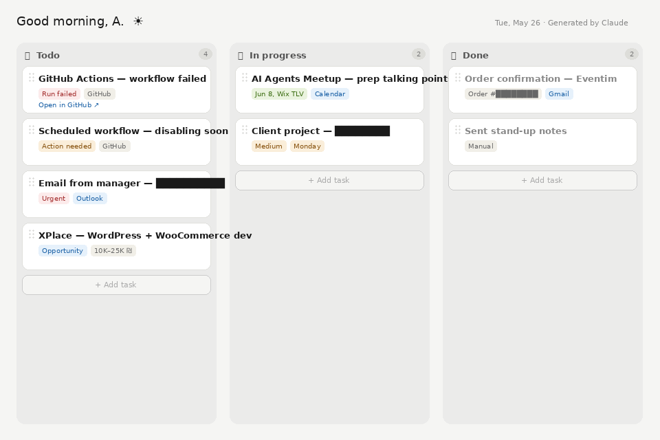

# Morning Briefing Dashboard — Claude Skill

> One prompt → interactive daily kanban board, built from your real inbox and tasks.



---

## What it does

```
start my day
```

Claude pulls from your connected sources, classifies everything by urgency, and produces a standalone HTML file you open in any browser:

| Feature | Details |
|---------|---------|
| 📋 Drag & drop | Move cards between **Todo / In Progress / Done** |
| ➕ Add tasks | `+` button in each column — title + priority tag |
| ✕ Delete | Hover any card to reveal the delete button |
| 🔗 Deep links | Cards link directly to Gmail threads, GitHub issues, Monday tasks |
| 🌐 Zero dependencies | Self-contained HTML — no server, no npm, no internet needed |

---

## Integrations

### Auto-pull (MCP connectors)

| Source | What gets pulled |
|--------|-----------------|
| **Gmail** | Inbox threads, last 2 days |
| **Google Calendar** | Today's events |
| **Monday.com** | Open items assigned to you |

### Paste-in (no connector needed)

| Source | How |
|--------|-----|
| **Outlook** | Copy email subjects/previews → paste in chat |
| **Obsidian** | Paste daily note — `- [ ]` tasks parsed automatically |
| **Notion / Linear / Jira** | Paste exported content |
| **Any text** | Free-form — Claude figures it out |

---

## Installation

### Cowork (Claude Desktop)

1. Download `morning-briefing.skill` from [Releases](../../releases)
2. Claude Desktop → Cowork → **Plugins → Install from file**

### Claude Code (CLI)

```bash
# macOS / Linux
cp -r morning-briefing/ ~/.claude/skills/

# Windows
Copy-Item -Recurse morning-briefing\ "$env:APPDATA\Claude\skills\"
```

### IDE agent (Cursor, Windsurf, etc.)

Drop this repo into your project root. The agent reads `CLAUDE.md` → follows `morning-briefing/SKILL.md` automatically.

---

## Usage

```
start my day
morning briefing
what's on my plate today?
organize my tasks — here's my Outlook: [paste]
set up my morning briefing every day at 7:30am
```

---

## Connecting sources

**Gmail / Google Calendar** — Cowork → Plugins → Connectors → Connect → authorize Google

**Monday.com** — Cowork → Plugins → Connectors → Monday → enter API token

**Outlook / anything else** — just paste in chat, no connector needed

---

## File structure

```
morning-briefing-dashboard/
├── README.md                  ← you are here (human docs)
├── CLAUDE.md                  ← IDE agent entry point → points to SKILL.md
├── screenshot.png
└── morning-briefing/
    └── SKILL.md               ← canonical spec (single source of truth)
```

> **For contributors:** all skill logic lives exclusively in `morning-briefing/SKILL.md`.
> README and CLAUDE.md contain no duplicated implementation details.

---

## License

MIT — free to use, share, and adapt. Built with [Claude](https://claude.ai).
